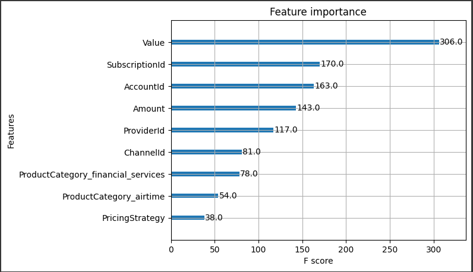

# Model Interpretation: Feature Importance Analysis

In this section, we analyze the feature importance of our trained XGBoost model to understand which features contribute most significantly to its predictions. By identifying the most influential features, we can gain valuable insights into the model’s decision-making process and potentially improve or simplify the model.

## Feature Importance Plot
The following plot illustrates the importance of each feature in the model. Features are ranked by their **F-score**, which measures how frequently each feature is used to split the data across all trees in the model.

### Observations
1. **Most Important Feature**:
   - The `Value` feature has the highest importance score, indicating it plays a significant role in the model’s predictions. This suggests that changes in `Value` have a substantial impact on the outcome.

2. **Moderately Important Features**:
   - `SubscriptionId`, `AccountId`, and `Amount` are the next most influential features. These features contribute significantly to the model, though not as much as `Value`. Their importance might imply that information related to subscriptions and accounts is critical for the predictions.

3. **Less Important Features**:
   - `ProviderId`, `ChannelId`, `ProductCategory_financial_services`, `ProductCategory_airtime`, and `PricingStrategy` have lower importance scores. These features may still contribute to the model but have a smaller effect on the predictions. We might consider these features for further analysis or potentially simplify the model by testing its performance without them.

## Potential Actions
- **Feature Engineering**:
  - Since `Value` has a strong influence, it might be worth exploring transformations or combinations with other features to enhance the model further.
  
- **Dimensionality Reduction**:
  - Consider removing the least important features (like `PricingStrategy` and `ProductCategory_airtime`) and re-evaluating the model performance. If performance remains consistent, simplifying the model could improve computational efficiency.

- **Deeper Analysis**:
  - For a more comprehensive understanding, SHAP analysis could be applied to observe how each feature influences individual predictions, especially for `Value`, `SubscriptionId`, and `AccountId`.

## Conclusion
Understanding feature importance allows us to make more informed decisions about model development. By identifying the most impactful features, we can streamline the model, focus on key factors, and potentially improve interpretability and performance.
